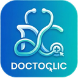

# 🩺 DoctoClic — Assistant IA pour Médecins Généralistes

Extension Chrome open-source de productivité pour médecins généralistes. Interface entièrement accessible via le menu contextuel (clic droit) : sélectionnez du texte sur n'importe quelle page web et appliquez une action IA adaptée à votre exercice quotidien.



---

## Fonctionnalités

9 actions IA accessibles via le clic droit sur du texte sélectionné :

| Action | Description |
|--------|-------------|
| ✏️ **Corriger & Reformuler** | Corrige l'orthographe/grammaire et reformule en français médical professionnel |
| 💬 **Répondre** | Génère une réponse professionnelle adaptée au contexte (email, message patient, confrère) |
| 📞 **Répondre Secrétariat** | Génère une réponse de secrétariat médical (RDV, renouvellements, questions admin) |
| 📋 **Résumer** | Résume un texte long en points structurés (CR, article PubMed, recommandation HAS) |
| ⚠️ **Interactions médicamenteuses** | Analyse les interactions médicamenteuses classées par gravité |
| ✉️ **Courrier de correspondance** | Génère un brouillon de courrier d'adressage à un confrère spécialiste |
| 📜 **Certificat médical** | Génère un brouillon de certificat avec mentions légales obligatoires |
| 🔬 **Interpréter examens** | Analyse tout type d'examen : biologie, imagerie, ECG, microbiologie... |
| 🌐 **Traduire en français** | Traduit en français en conservant la terminologie médicale exacte |

## Fournisseurs API supportés

| Fournisseur | Conformité | Description |
|-------------|-----------|-------------|
| **Azure OpenAI (HDS)** | 🛡️ Conforme HDS | Données hébergées en France/EEE. Recommandé pour l'usage clinique. |
| **Serveur local** | 🔒 100% hors-ligne | Ollama, LM Studio, llama.cpp, vLLM, LocalAI. Confidentialité maximale. |
| **OpenAI Direct** | ⚠️ Non conforme HDS | Données transitent aux USA. Ne pas utiliser avec des données de santé personnelles. |

## Installation

1. **Téléchargez** ou clonez ce dépôt :
   ```bash
   git clone https://github.com/votre-username/doctoclic.git
   ```

2. **Ouvrez Chrome** et accédez à `chrome://extensions/`

3. **Activez le mode développeur** (toggle en haut à droite)

4. **Cliquez sur "Charger l'extension non empaquetée"** et sélectionnez le dossier `doctoclic`

5. **Configurez l'extension** : cliquez sur l'icône DoctoClic dans la barre d'outils pour ouvrir les options, puis sélectionnez votre fournisseur API et renseignez vos identifiants.

## Configuration

### Azure OpenAI (HDS) — Recommandé

1. Créez une ressource Azure OpenAI dans la région **France Central**
2. Déployez un modèle avec le type **Data Zone Standard (EUR)**
3. Désactivez le logging de surveillance (`ContentLogging = false`)
4. Renseignez dans les options : clé API, endpoint, nom du déploiement

### Serveur local

1. Installez [Ollama](https://ollama.ai), [LM Studio](https://lmstudio.ai) ou tout serveur compatible OpenAI API
2. Lancez le serveur (ex: `ollama serve`)
3. Renseignez l'URL du serveur et le nom du modèle dans les options
4. Utilisez le bouton "Tester la connexion" pour vérifier

### OpenAI Direct

1. Obtenez une clé API sur [platform.openai.com](https://platform.openai.com/api-keys)
2. Renseignez la clé dans les options
3. Sélectionnez le modèle souhaité

## Conformité et données de santé

> **Important** — Lisez attentivement cette section avant tout usage clinique.

1. **Outil d'aide uniquement** — DoctoClic est un outil d'aide à la rédaction et à l'analyse. Il **ne remplace en aucun cas le jugement médical** du praticien. Toutes les réponses générées doivent être vérifiées avant utilisation.

2. **Usage conforme HDS** — Pour un usage conforme à la réglementation HDS (Hébergement de Données de Santé), il est impératif d'utiliser **Azure OpenAI** avec :
   - Une ressource déployée en région **France Central**
   - Un déploiement de type **Data Zone Standard (EUR)** pour que les données restent dans l'Espace Économique Européen
   - Le logging de surveillance des abus désactivé (`ContentLogging = false`) via le portail Azure
   - Les clauses contractuelles HDS signées avec Microsoft

3. **OpenAI Direct non conforme** — L'option OpenAI Direct **n'est pas conforme HDS** (article L.1111-8 du Code de la santé publique). Les données transitent par les serveurs OpenAI situés aux États-Unis. **Ne l'utilisez pas** avec des données de santé à caractère personnel.

4. **Serveur local** — L'option serveur local offre la confidentialité maximale : aucune donnée ne quitte votre ordinateur. Cependant, la qualité des réponses dépend du modèle utilisé.

5. **Responsabilité** — L'utilisateur est seul responsable de la conformité de son infrastructure (Azure ou autre) avec la certification HDS et la réglementation en vigueur.

6. **Aucun stockage de données de santé** — L'extension ne stocke aucune donnée de santé localement. Les textes sont envoyés à l'API en temps réel et ne sont jamais mis en cache ni journalisés par l'extension. Aucun historique des requêtes ou réponses n'est conservé.

## Sécurité technique

- Les clés API ne quittent jamais le Service Worker (background.js)
- Aucune donnée n'est exposée dans le DOM ni dans le content script
- Communication content/background via `chrome.runtime.sendMessage`
- Contenu construit via le DOM API (pas de `innerHTML` brut avec des données utilisateur)
- Permissions Chrome minimales
- Aucun analytics, tracking ou télémétrie
- Vérification du domaine Azure (`*.openai.azure.com`) avant tout envoi en mode HDS

## Architecture

```
doctoclic/
├── manifest.json       # Manifest V3
├── background.js       # Service Worker — menu contextuel + appels API
├── content.js          # Script injecté — modale de résultat
├── content.css         # Styles de la modale
├── options.html        # Page d'options
├── options.js          # Logique des options
├── icons/              # Icônes de l'extension
│   ├── icon16.png
│   ├── icon48.png
│   └── icon128.png
├── README.md
└── LICENSE
```

## Contribution

Les contributions sont les bienvenues ! Pour contribuer :

1. Forkez le projet
2. Créez une branche (`git checkout -b feature/ma-fonctionnalite`)
3. Committez vos changements (`git commit -m 'Ajout de ma fonctionnalité'`)
4. Pushez la branche (`git push origin feature/ma-fonctionnalite`)
5. Ouvrez une Pull Request

## Licence

Ce projet est sous licence MIT. Voir le fichier [LICENSE](LICENSE) pour plus de détails.

---

*DoctoClic est un projet open-source indépendant. Il n'est affilié à aucun éditeur de logiciel médical, à OpenAI, ni à Microsoft.*
